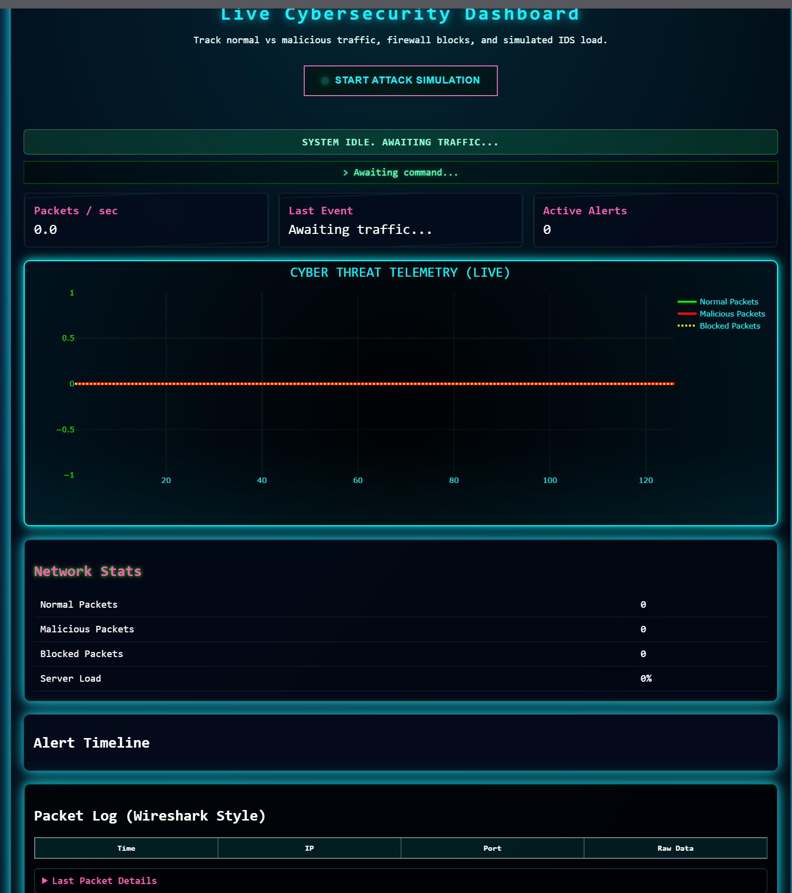
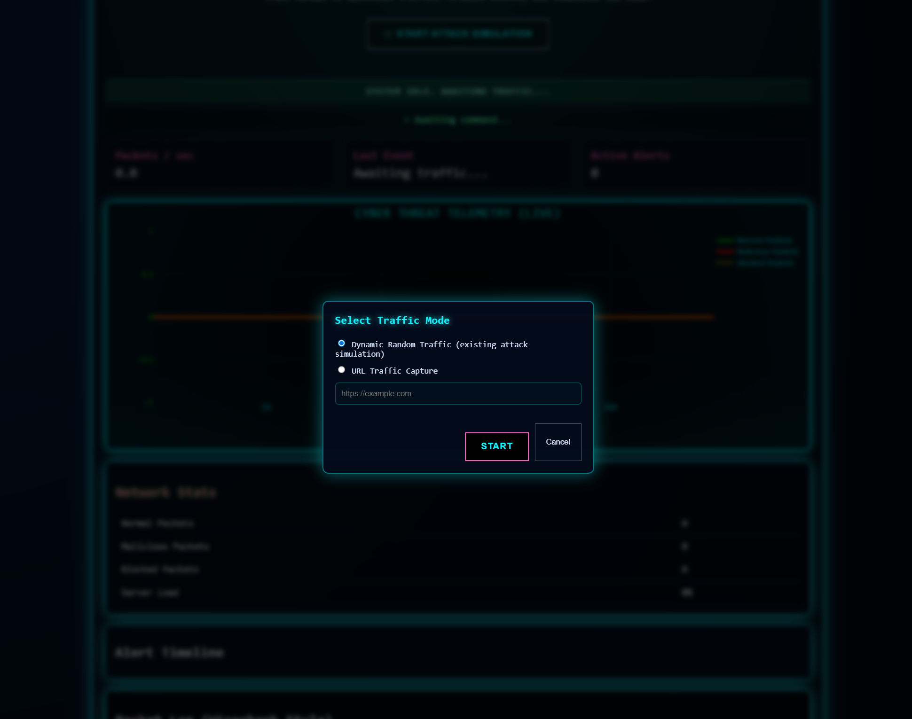
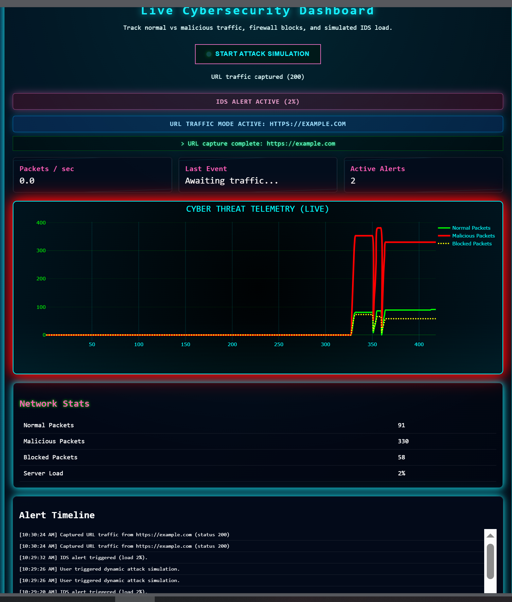
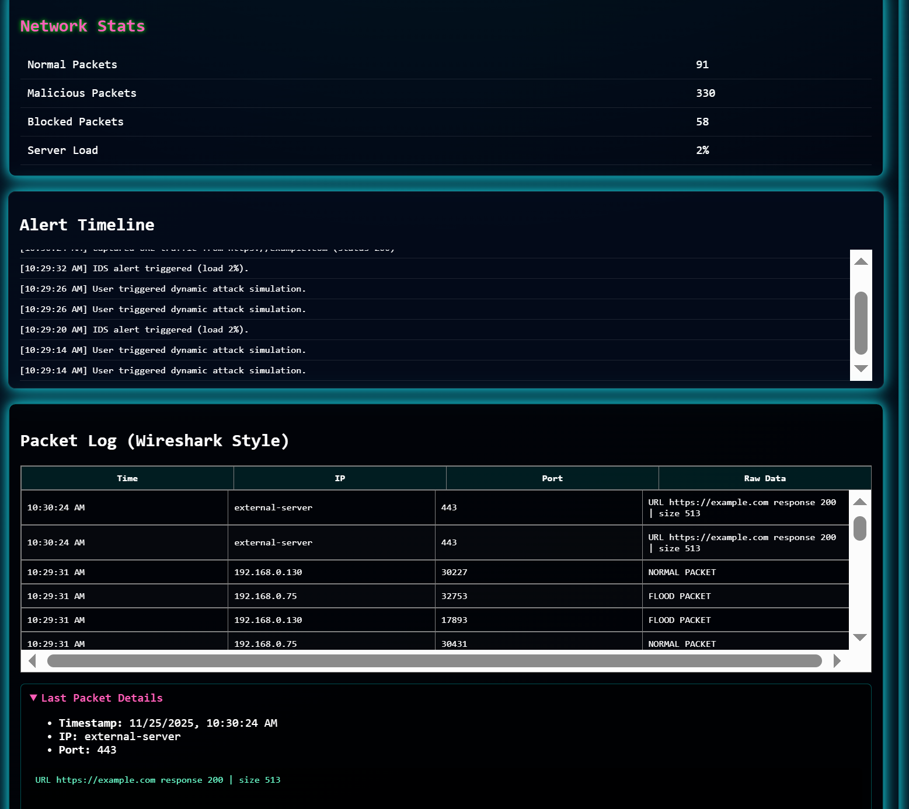

# Cybersecurity Attack & Defense Simulator

[](LICENSE)
[](https://www.python.org/)
[](https://flask.palletsprojects.com/)
[](https://plotly.com/python/)
[](https://scapy.net/)

A dynamic web-based simulator for cybersecurity attacks and defenses, built with Flask, Plotly, and Scapy. Simulate port scanning, packet flooding, and real-time traffic monitoring with IDS alerts and firewall rules. Features two modes: **Attack Mode** (simulate threats via URL triggers) and **Dynamic Mode** (real-time packet generation). Perfect for educational demos and learning network security concepts.

**Team:**

- Gotam Kumar (23k-0860)
- Mohit Kumar (23k-2035)
- Ahmed Raza (22k-4780)

---

## 🚀 Overview

This simulator mimics a client-server network environment to demonstrate common cybersecurity threats (port scanning and DDoS flooding) and defenses (firewall blocking and IDS anomaly detection). Users can trigger attacks via a sleek web dashboard, watch live packet logs in Wireshark-style format, and visualize traffic with interactive Plotly graphs (green for normal, red for malicious).

Key Highlights:

- **Real-Time Visualization:** Cumulative line graphs showing normal vs. malicious traffic spikes.
- **Dual Modes:**
  - **Attack Mode:** Trigger scans/floods from URL endpoints (e.g., `/start_attack`).
  - **Dynamic Mode:** Auto-generate random packets (300-500 total, 10-25% normal mix) for varied simulations.
- **Educational Focus:** Console logs show every packet send/receive, detection, and alerts – ideal for proposal demos.

Inspired by real-world tools like Wireshark and Snort, this project fulfills the proposal's phases: Networking (TCP sockets), Attacks (scapy-based flooding), Defense (IDS thresholds), and Visualization (Plotly dashboards).

---

## ✨ Features

- **Interactive Dashboard:** Flask web UI with stats table, attack button, and live graph updates (every 2 seconds).
- **Packet Simulation:** Random dynamic floods (malicious/normal mix) with console logs for every packet (receive, classify, alert).
- **IDS & Firewall:** Debounced alerts on traffic spikes (3-5 per run), IP/port blocking.
- **Graph Types:** Plotly line plots for cumulative packets – red spikes for attacks, green for normal; hover tooltips for details.
- **API Endpoints:** `/api/stats` (real-time stats), `/api/packets` (Wireshark-style logs), `/api/graph` (graph JSON).
- **Modes:**
  - **Attack Mode:** Button-triggered scans/floods via URL (e.g., POST to `/start_attack`).
  - **Dynamic Mode:** Auto-random packets for self-generating traffic (no button needed).
- **Wireshark-Style Logs:** Expandable packet details in console/browser (IP, port, timestamp, raw data).
- **Reset & Replay:** Auto-reset state after simulation for multiple runs.

---

## 🛠️ Installation

1. **Clone the Repo:**

   ```
   git clone https://github.com/gotamk-786/cybersecurity-attack& defense simulator.git
   cd cybersecurity-simulator
   ```

2. **Virtual Environment (Recommended):**

   ```
   python -m venv venv
   # Windows
   venv\Scripts\activate
   # Mac/Linux
   source venv/bin/activate
   ```

3. **Install Dependencies:**
   ```
   pip install -r requirements.txt
   ```

Requirements include Flask for web, Plotly for graphs, Scapy for packet simulation.

---

## 🚀 Usage

1. **Run the Simulator:**

   ```
   python app.py
   ```

   - Server starts on `http://127.0.0.1:5000`.
   - TCP defender listens on localhost:12345 for simulated traffic.

2. **Access Dashboard:**

   - Open browser: [http://127.0.0.1:5000](http://127.0.0.1:5000).
   - Stats table shows 0 initial (normal/malicious/blocked/load).
   - Graph is empty (waiting for packets).

3. **Trigger Attack (Attack Mode):**

   - Click "Start Attack Simulation" button.
   - **Console Logs:** Real-time packet show (e.g., "[PKT] 127.0.0.1:xxxxx -> FLOOD PACKET", "[CLASSIFY] Malicious count: 1", "[IDS] Traffic spike detected!").
   - **Graph Update:** Red line spikes for malicious flood, green for normal mix (auto-refetch every 2 sec).
   - **Stats:** Table updates (Malicious: 340+, Normal: 60+, Load: 3-5).

4. **Dynamic Mode (Auto):**

   - No button – Simulation auto-starts on button, but for dynamic, reload page (reset state) and click again for varied runs (random packet mix).

5. **API Usage (Advanced):**

   - GET `/api/stats`: JSON stats (e.g., {"normal": 60, "malicious": 340}).
   - GET `/api/packets`: Last 200 packets (Wireshark-style: IP, port, timestamp, raw).
   - GET `/api/graph`: Plotly JSON for graph (red/green lines).
   - POST `/start_attack`: Trigger simulation.

6. **Stop:** Ctrl+C in terminal – Auto-reset for next run.

**Example Console Output (During Attack):**

```
[SERVER] Listening on 127.0.0.1:12345
[SIM] Port Scan starting...
[PKT] 127.0.0.1:xxxxx -> PORT SCAN ATTACK
[CLASSIFY] Malicious count: 1
[IDS] Traffic spike detected!
[SIM] Flood Attack starting...
[PKT] 127.0.0.1:xxxxx -> FLOOD PACKET
[CLASSIFY] Malicious count: 2
[PKT] 127.0.0.1:xxxxx -> NORMAL PACKET
[CLASSIFY] Normal count: 1
[IDS] Traffic spike detected!
Attack simulation done.
```

**Graph:** Interactive Plotly lines – Red spike for flood (malicious), green smooth for normal – Hover for packet details.

---

## 📁 Project Structure

```
cybersecurity-simulator/
├── app.py                 # Flask backend (server, simulation, API)
├── requirements.txt       # Dependencies
├── templates/
│   └── index.html         # Dashboard HTML
└── static/
    ├── style.css          # UI styles (neon theme)
    └── script.js          # JS for button, real-time fetch/re-plot
└── README.md              # This file
└── proposal.pdf           # Project proposal
```

---

## 🎯 Modes

- **Attack Mode (URL-Triggered):** POST to `/start_attack` or button click – Simulates port scan + 5-sec flood (random 300-500 packets, 20% normal mix). Logs every packet, graph spikes red for malicious.
- **Dynamic Mode:** Auto-random generation during attack – Vary ratio/duration for different runs (e.g., 10% vs 25% normal). Reset state on reload for fresh simulation.

Switch modes by button/reload – Dynamic for varied demos, attack for quick tests.

---

## 🔧 Customization

- **Packet Rate:** Edit `time.sleep(0.01)` in simulate_attack() for faster/slower floods.
- **Graph Style:** Plotly config in app.py – Add bar charts or heatmaps for advanced viz.
- **Alerts:** Adjust COOLDOWN = 5 for more/fewer IDS alerts.
- **Firewall:** Add IPs to BLOCKED_IPS = ["127.0.0.1"] for blocking localhost attacks.

---

## 📊 Screenshots

(Screenshots future mein lagau ga – Abhi placeholders hain. "screenshots" folder banao, PNG files add karo, paths update karo. )

 – Initial view with stats and empty graph.
 – show mode
 – show mode

 – Graph spiking red during flood, stats updating.

 – Console showing real-time packet receive/classify.

---

## 🤝 Contributing

1. Fork the repo.
2. Create branch (`git checkout -b feature/xyz`).
3. Commit changes (`git commit -m 'Add feature'`).
4. Push (`git push origin feature/xyz`).
5. Open Pull Request.

---

---

## 📞 Contact

- **Team Lead:** Gotam kumar
- **Issues:** [GitHub Issues](https://github.com/gotamk-786/cybersecurity-simulator/issues)

**Acknowledgements:** Built for Fast NUCES Karachi Campus Computer Networks project proposal (Oct 15, 2025). Special thanks to Flask and Plotly teams.
